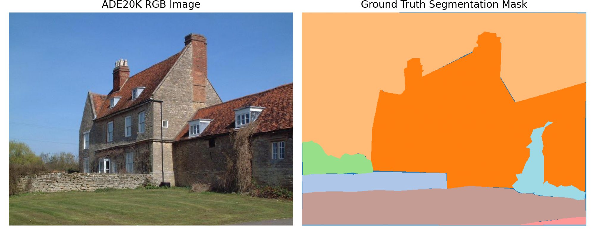
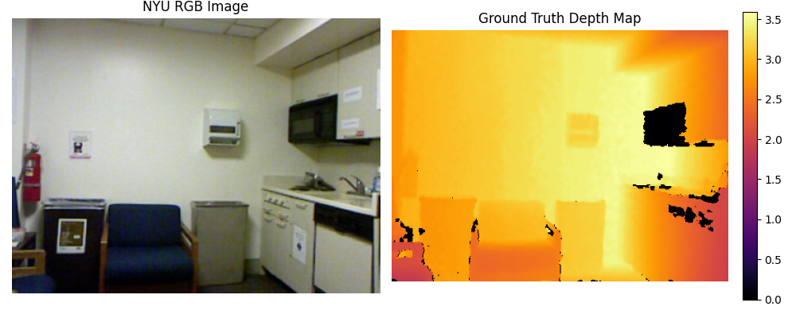
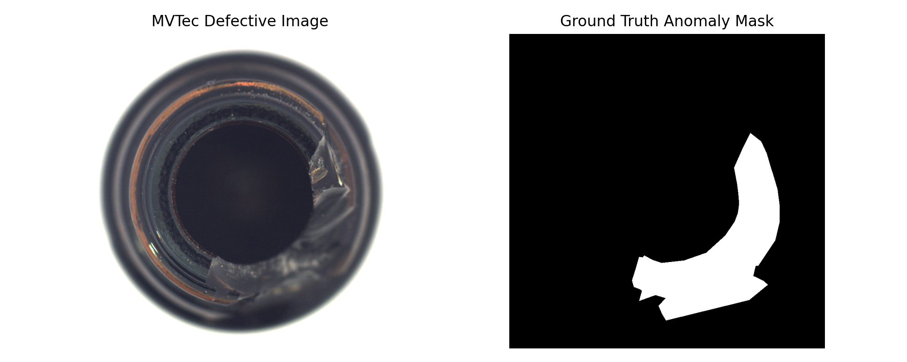
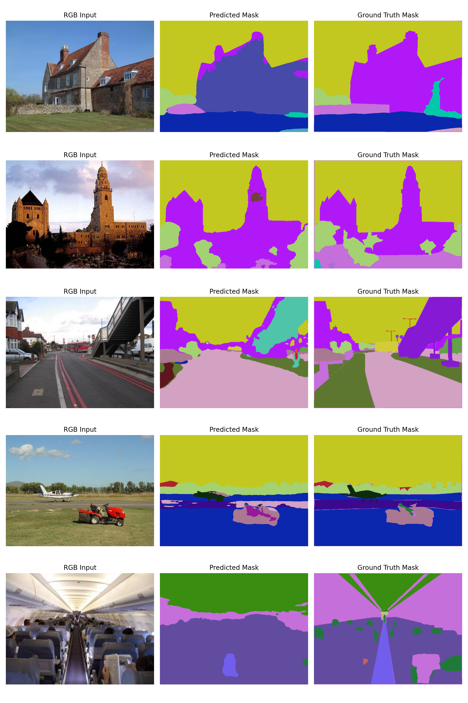
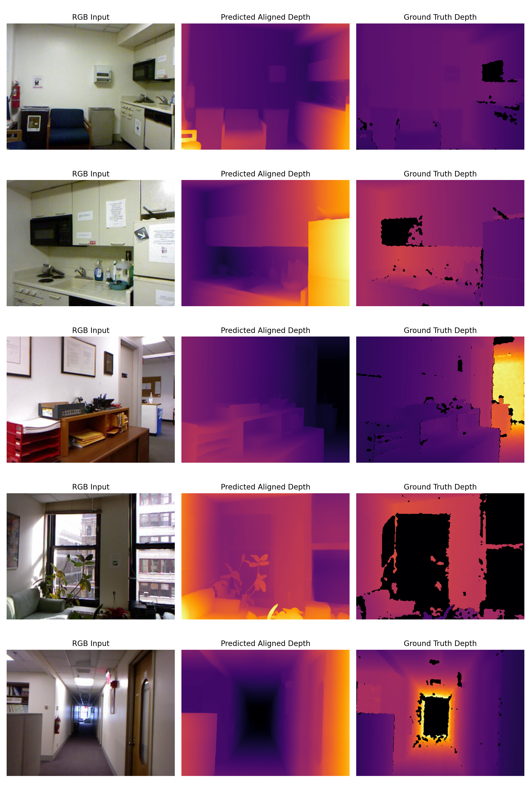
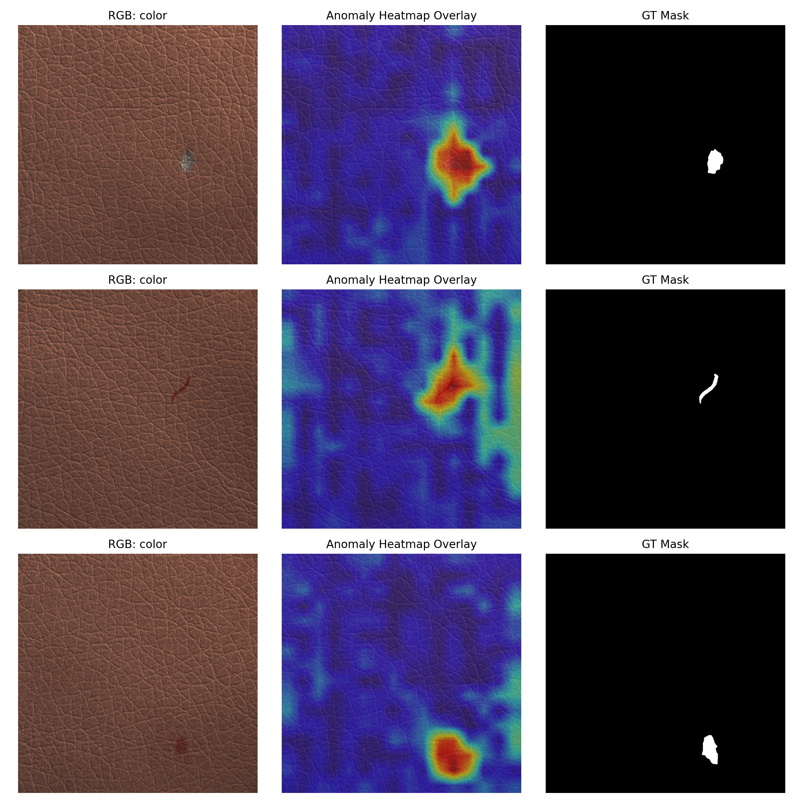
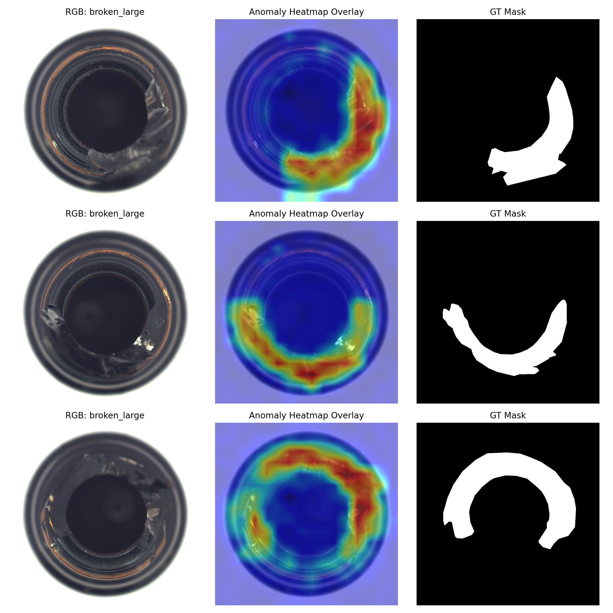
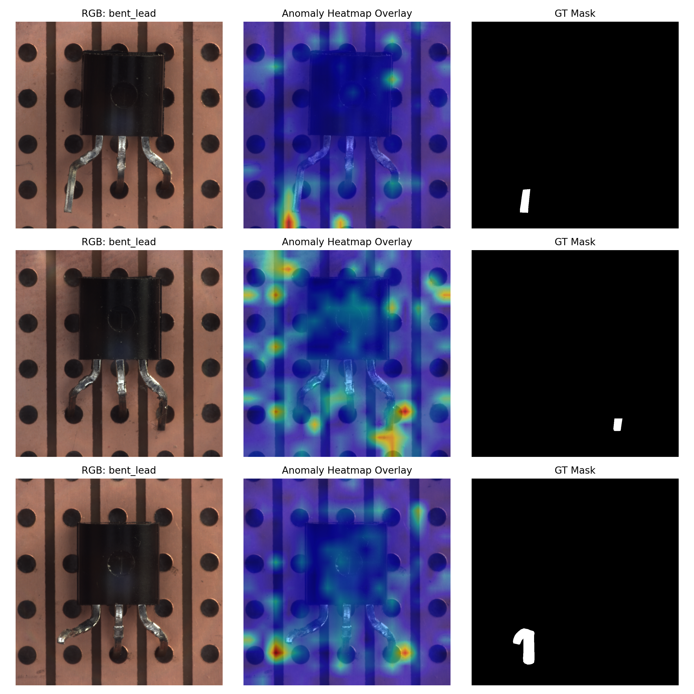

# Pretrained Models for Image Applications

This project evaluates frozen pretrained vision models on three image-understanding problems: semantic segmentation, monocular depth estimation, and visual anomaly detection. It demonstrates how general-purpose checkpoints can be applied to new tasks with little or no task-specific training in the script.

## What it demonstrates

- Semantic segmentation with `nvidia/segformer-b0-finetuned-ade-512-512` on ADE20K
- Monocular depth estimation with `depth-anything/Depth-Anything-V2-Small-hf` on NYU-Depth-v2
- Patch-level anomaly detection with `facebook/dinov2-small` on MVTec-AD
- Quantitative evaluation and qualitative visualization of model behavior

## Recorded results

| Task | Dataset | Metric |
| --- | --- | --- |
| Semantic segmentation | ADE20K, 100 validation images | mIoU `0.2698` |
| Monocular depth | NYU-Depth-v2, 100 validation images | AbsRel `0.8264` |
| Anomaly detection | MVTec-AD: leather, bottle, transistor | Mean AUROC `0.9767` |

Leather and bottle reached AUROC `1.0000`; transistor reached `0.9300`. The generated figures show representative inputs, predictions, depth maps, ground truth, and anomaly heatmaps. The results are task-dependent: anomaly detection is strong on the selected categories, while segmentation and depth estimation are more challenging under the given evaluation setup.

## Visual results

### Dataset examples







### Predictions and anomaly localization











## Run

```bash
python -m venv .venv
# Windows
.venv\Scripts\activate
# macOS/Linux: source .venv/bin/activate
pip install -r requirements.txt
python image_model_applications.py
```

The script expects ADE20K and MVTec-AD under `data/`, while NYU-Depth-v2 is loaded through Hugging Face Datasets. Model weights and datasets are downloaded or read on first use. The full experiment benefits from a CUDA-capable machine and substantial storage.

## Results files

- `ade20k_segmentation_examples.png` - RGB, predicted, and ground-truth segmentation masks
- `nyu_depth_estimation_examples.png` - depth predictions and ground truth
- `mvtec_dinov2_*_heatmaps.png` - anomaly localization for each category
- `*_example_visualization.png` - dataset examples
